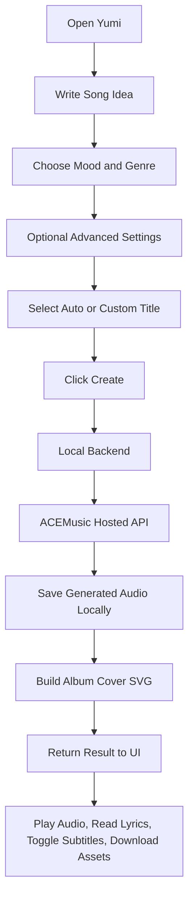
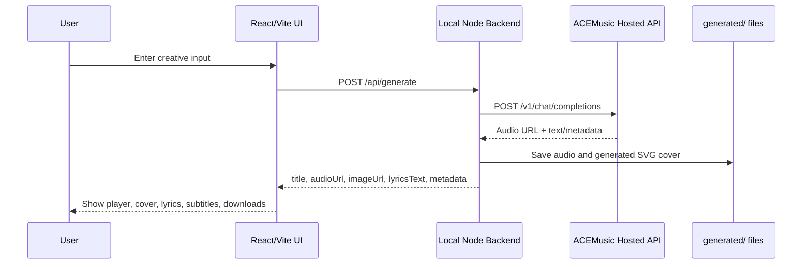
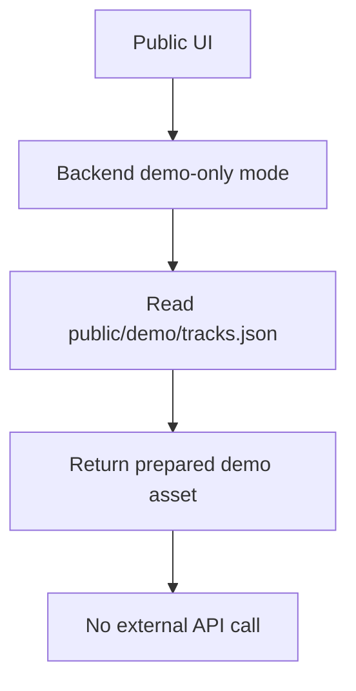

# Design Document — Yumi

## 1. Overview

Yumi is a Korean-first AI music creator web app. The interface is built around a
single creator workspace rather than a marketing landing page.

Users describe a song, adjust musical preferences, generate a track through a
local backend, and inspect the result in a right-side playback panel.

The current implementation is a React/Vite MVP with a local Node backend and an
ACEMusic hosted provider integration.

## 2. Design Principles

### Creator-First Interface

The first screen should feel like a working creative tool. Users can immediately
write a song idea, select mood and genre, and generate music.

### Korean-First, Mixed-Language Friendly

The UI uses Korean labels for the creator workflow while allowing English artist
names, English prompts, and mixed Korean/English lyric ideas.

### AI as Creative Support

The design should present AI as a collaborative creative medium. It should avoid
claims that the system replaces human musicians or guarantees professional music
production quality.

### Safe Local API Boundary

The browser must never receive the hosted provider API key. The local backend is
part of the product design because it protects credentials and normalizes
provider output before the UI displays it.

## 3. Current UX Structure

Yumi uses a two-column creator layout:

| Area | Purpose |
| --- | --- |
| Left main composer | Song idea, quick prompts, mood, genre, artist, title, vocal, sound, duration |
| Right result panel | Album cover, download menu, title, metadata, audio player, lyrics, subtitles toggle |

The design is intentionally compact and tool-like:

- no separate landing page
- no multi-page onboarding
- no card-heavy marketing sections
- immediate access to the creation form

## 4. Main User Flow



## 5. Information Architecture

### Composer Controls

| Control | Description |
| --- | --- |
| Song idea textarea | Main prompt area for lyrics, mood, scene, or creative direction |
| Quick ideas | Prewritten creative starters |
| Mood chips | Korean mood selection |
| Genre chips | Multi-select genre controls |
| Reference artists | Free input plus quick-add artist chips |
| Title mode | `자동 제목` or `직접 제목` |
| Style description | Production and genre direction |
| Sound details | Specific instrument/sound texture notes |
| Vocal tone | Vocal style or instrumental mode |
| Duration | Approximate target length |

### Result Panel

| Element | Description |
| --- | --- |
| Album cover | SVG image generated from final title and metadata |
| Download menu | Audio, cover, and lyrics text downloads when available |
| Play button | Large overlay play/pause control |
| Subtitle overlay | Optional approximate subtitle display |
| Provider label | Shows hosted API/demo status |
| Result title | Final title from custom title, provider title, or fallback |
| Metadata rows | Mood, genre, vocal, usage/local record |
| Audio player | Native audio controls |
| `가사` block | Generated/provider lyrics only |

## 6. System Architecture

### Tech Stack

| Layer | Current Technology |
| --- | --- |
| Frontend | React 19 + Vite 8 + TypeScript |
| Styling | Tailwind CSS 4 |
| Backend | Node.js HTTP server |
| Music provider | ACEMusic hosted API |
| Local generated assets | `generated/` |
| Demo assets | `public/demo/` |
| Usage state | `server/data/usage.json` |

### Runtime Flow



### Public Demo Flow



Demo-only mode exists to keep private generation keys safe during public
portfolio deployment.

## 7. Data Model

```ts
type MusicGenerationInput = {
  mood: string;
  genres: string[];
  artists: string[];
  styleDescription: string;
  lyricsOrIdea: string;
  vocalTone: string;
  soundDetails: string;
  duration: string;
  titleMode: "auto" | "custom";
  customTitle: string;
};

type GeneratedMusicResult = {
  title: string;
  audioUrl?: string;
  imageUrl?: string;
  prompt: string;
  lyricsText?: string;
  source: "local" | "demo";
  provider?: string;
  providerLabel?: string;
  metadata?: Record<string, unknown>;
  notice?: string;
  usage?: {
    date: string;
    count: number;
    limit: number | null;
    provider?: string;
    purpose?: string;
  };
};
```

## 8. Backend Design

The backend performs four main responsibilities:

1. Normalize frontend input.
2. Build a structured provider prompt.
3. Call the hosted provider using server-side credentials.
4. Save and serve generated assets.

### Provider Prompt Design

The prompt includes:

- song title instruction
- mood direction
- reference artist warning: vibe only, no imitation
- style and sound details
- vocal/instrumental instruction
- duration target
- mixed-language lyric rules
- request for generated lyrics separate from metadata

### Title Resolution

Final title priority:

1. Custom user title
2. Provider title, if returned and usable
3. Local fallback title based on current creator input

The final title is used by:

- result heading
- album cover
- generated audio filename
- download filename

### Lyrics Resolution

The app does not use the user's textarea as generated lyrics. It only displays
lyrics returned by the provider or demo manifest. Provider metadata is filtered
out when possible.

### Subtitle Timing

Subtitle display uses available lyric lines. If provider timestamp metadata is
available, the UI can use it. Otherwise, Yumi applies approximate timing across
the audio duration. Section labels are kept visible but weighted shorter than
lyric lines.

This is not true word-level voice alignment.

## 9. Security Design

| Risk | Mitigation |
| --- | --- |
| API key exposed in browser | Backend-only `.env.local` usage |
| Secrets committed to Git | `.gitignore` + `npm run security:check` |
| Public visitors using private key | `DEPLOY_DEMO_ONLY=true` |
| Generated files committed accidentally | `generated/` excluded |
| Provider metadata shown as lyrics | Lyrics extraction/filtering |

## 10. MVP Scope

### Included

- Creator interface
- Mood/genre/vocal/sound controls
- Reference artists
- Auto/custom title
- Hosted music generation through backend
- Demo mode
- Album cover SVG generation
- Lyrics display
- Optional subtitles
- Asset downloads
- Security check script

### Excluded

- Authentication
- Database
- Cloud file persistence
- Payment/billing
- Community sharing
- Music editing
- Guaranteed timestamp alignment
- Commercial publishing workflow

## 11. Verification Checklist

Before publishing:

```bash
npm run typecheck
npm run build
npm run security:check
node --check server/local-music-server.mjs
```

Runtime checks:

```bash
curl http://127.0.0.1:4000/api/health
curl http://127.0.0.1:4000/api/usage
```

Manual UI checks:

- app loads at `http://localhost:5173`
- layout remains two-column creator UI
- `가사` header appears correctly
- subtitles toggle is visible
- download menu opens
- generated title appears on the cover and result panel
- no API key is visible in browser code

## 12. Future Design Opportunities

- Real timestamp or forced-alignment subtitle support
- Richer provider title metadata handling
- Persistent history
- Shareable song pages
- User accounts
- Better album-art generation
- Hugging Face Space demo packaging
- Optional model/provider selector for research comparison

## Final Concept

Yumi is a Korean-first AI music creator that demonstrates how a local secure
backend, hosted music generation, and a focused creator UI can support emotional
expression and Human-AI creative exploration.
