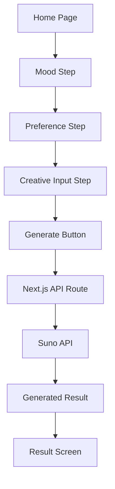
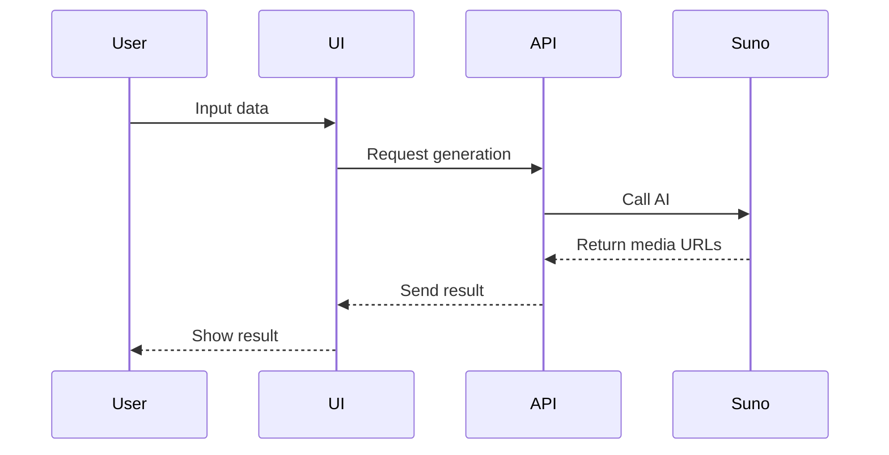

# 🎨 Design Document — Yumi (AI Music Generation Web App)

## 1. PRD Summary

**Yumi** is a web-based AI music generation service that creates new music based on user emotions and preferences.

Existing platforms like Spotify and YouTube Music provide large amounts of content, but users often struggle to find music that matches their current mood, and recommendations become repetitive.

Yumi allows users to input emotions, genres, and creative ideas, and generates music using a Suno API-based system.

**Core Users:**

* Students
* Users who enjoy music and want to create their own

**Core Value:**

* “Music created from my emotions”
* Transition from listener → creator

---

## 2. Solution Options Comparison

| # | Solution                      | Description                           | Pros                             | Cons                     | Complexity |
| - | ----------------------------- | ------------------------------------- | -------------------------------- | ------------------------ | ---------- |
| 1 | Guided step flow              | Emotion → Preference → Creative input | Easy for beginners, MVP-friendly | Slightly limited freedom | Low        |
| 2 | Prompt-based                  | Free text input                       | High flexibility                 | Hard for beginners       | Low        |
| 3 | One-click emotion             | Select emotion only                   | Fast and simple                  | Low personalization      | Low        |
| 4 | Hybrid (recommend + generate) | Combine recommendation + generation   | Familiar + creative              | More complex             | Medium     |
| 5 | Community-based               | Share generated music                 | High engagement                  | Needs DB & accounts      | High       |

**Selected Solution:**
👉 Guided step flow

---

## 3. Solution Overview

Users create music through a guided experience:

1. Select emotion
2. Choose genre and artists
3. Enter lyrics / creative direction
4. Generate music
5. View result (audio + visuals)

### Expected Impact

* Low barrier to entry
* Encourages repeated use
* Enables creative participation
* Shifts from “finding music” → “creating music”

---

## 4. System Architecture

### Tech Stack

| Layer         | Technology          |
| ------------- | ------------------- |
| Frontend      | Next.js (React)     |
| Backend       | Next.js API Routes  |
| AI Generation | Suno API (planned)  |
| Storage       | Not included in MVP |
| Deployment    | Vercel              |
| Database      | Not included in MVP |

**Why Next.js?**

* Combines frontend + backend
* Protects API keys server-side

---

### Component Flow



---

### Components

| Component         | Role               |
| ----------------- | ------------------ |
| HomePage          | Intro + Start      |
| MoodStep          | Select mood        |
| PreferenceStep    | Genre & artists    |
| CreativeInputStep | Lyrics & style     |
| GenerateButton    | Trigger generation |
| LoadingState      | Show progress      |
| ResultScreen      | Display output     |

---

### Data Model

```ts
type MusicGenerationInput = {
  mood: string;
  genres: string[];
  artists?: string[];
  lyricsOrIdea: string;
  styleDescription?: string;
};

type GeneratedMusicResult = {
  audioUrl: string;
  imageUrl?: string;
  videoUrl?: string;
  title?: string;
};
```

---

### API Flow



---

## 5. User Flow

### Screen 1 — Home

* Intro text
* Start button

---

### Screen 2 — Mood Input

* Select or type mood
  Examples:
* Happy
* Calm
* Sad
* Energetic

---

### Screen 3 — Preferences

* Genre selection
* Artist input

---

### Screen 4 — Creative Input

User defines:

* Lyrics
* Mood
* Vocal style
* Instruments
* Sound details

---

### Screen 5 — Loading

Emotion-based messages:

* “Yumi is creating your music…”
* “Composing melody…”
* “Preparing album cover…”

---

### Screen 6 — Result

| Element           | Required | Description  |
| ----------------- | -------- | ------------ |
| Album cover       | Yes      | Visual       |
| Audio player      | Yes      | Playback     |
| Video             | Optional | If available |
| Regenerate button | Yes      | Retry        |
| Download          | Optional | Future       |

---

## 6. MVP Scope

### Included

| Priority | Feature         |
| -------- | --------------- |
| 1        | Mood input      |
| 2        | Preferences     |
| 3        | Creative input  |
| 4        | API integration |
| 5        | Result screen   |
| 6        | Regenerate      |

---

### Excluded

| Feature   | Reason              |
| --------- | ------------------- |
| Auth      | Too heavy           |
| Database  | Not needed yet      |
| Sharing   | Needs storage first |
| Community | Too complex         |
| Editing   | Advanced feature    |

---

## 7. 4-Week Plan

**Week 1**

* Setup Next.js
* Home + Mood screen

**Week 2**

* Preference + Creative screens
* State management

**Week 3**

* API route
* Suno integration (mock → real)

**Week 4**

* Result screen
* UI polish
* Demo prep

---

## Final Concept

Yumi is a web-based AI music creation platform where users generate music through guided emotional input.

---

## One-line Summary

👉 Yumi transforms user emotions into personalized AI-generated music through a guided creative experience.
